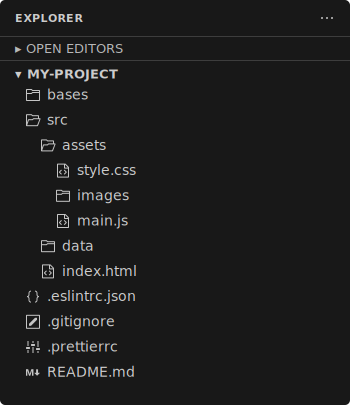
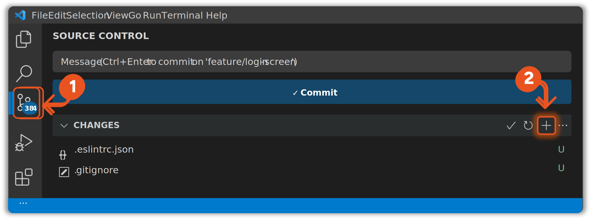
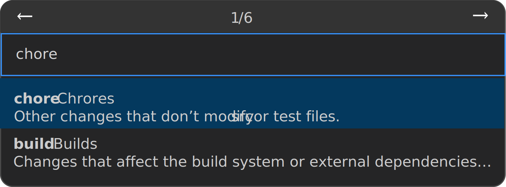
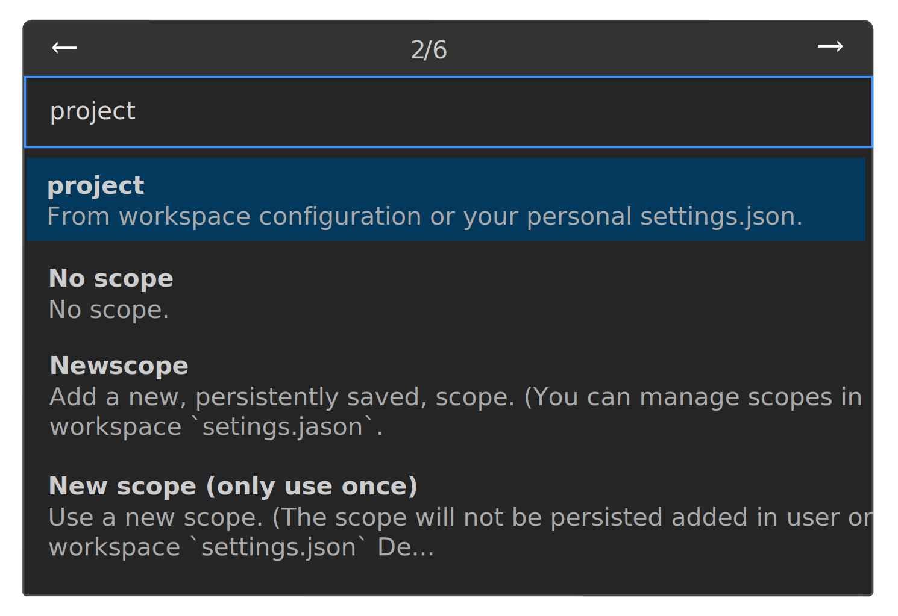
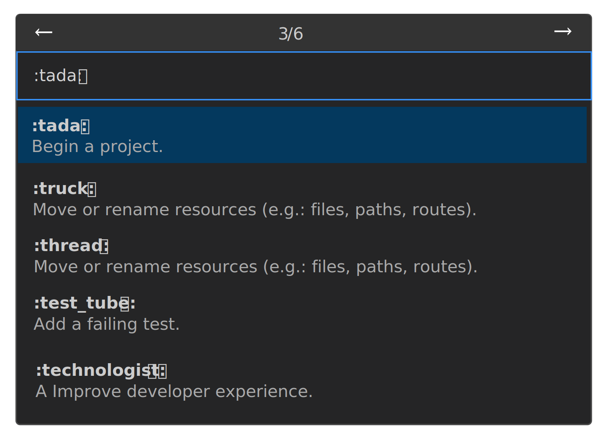
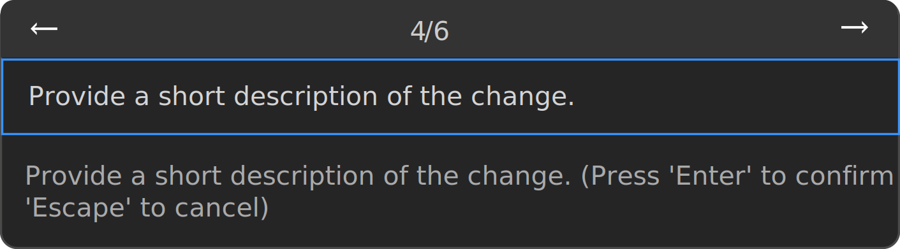
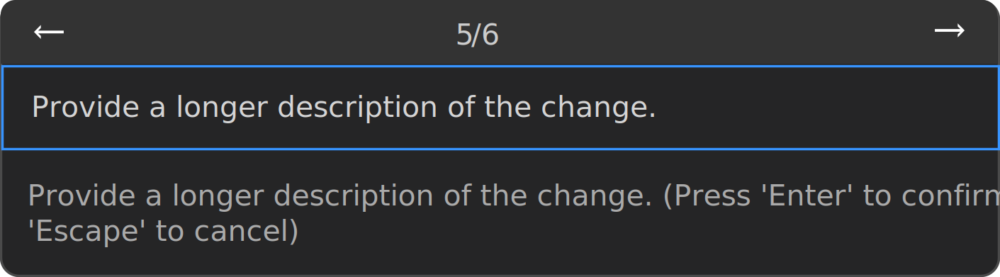
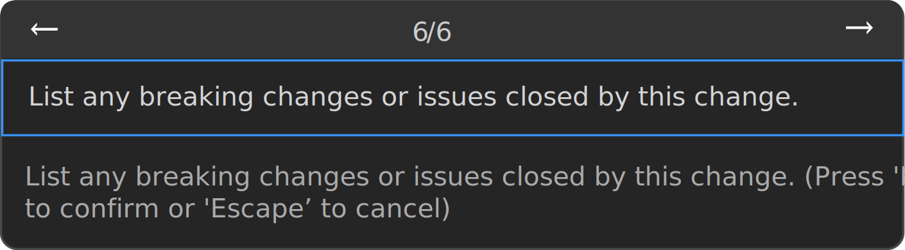
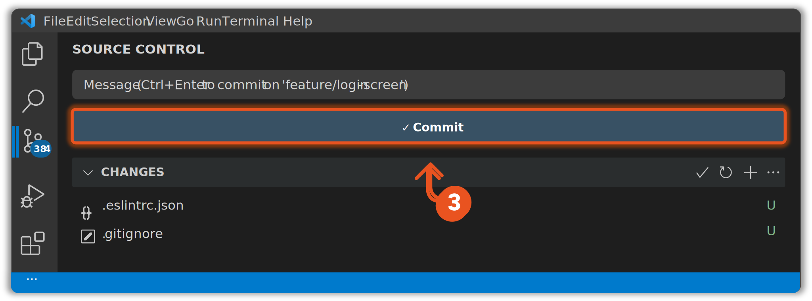

# **🧭 Manual Prático de Bordo: Padronização de Projetos seguindo a NOR.DS.001**

## 1. Contexto e Objetivo:
Este tutorial é o guia prático para iniciar qualquer novo projeto de desenvolvimento, garantindo que ele nasça alinhado às diretrizes da ``NORMA DE DESENVOLVIMENTO DE SOFTWARE 001`` e às melhores práticas de mercado. Ele serve como um checklist e uma fonte de consulta para refatorar projetos existentes e criar novos com uma fundação sólida e organizada.
## 2. Preparando o Terreno (Configuração do Ambiente)
O objetivo desta fase é criar a estrutura inicial do projeto e configurar as ferramentas que garantirão a qualidade e a padronização do nosso código desde o primeiro dia.
### **Passo 1:** ⚙️Configurar o VS Code
* **Diretriz:** Para garantir a eficiência e a padronização, utilizamos um ambiente de desenvolvimento integrado (IDE) com ferramentas que automatizam as regras de qualidade. O VS Code, com as extensões certas, é perfeito para isso.
* **🔰Ação:** Na aba de Extensões (ícone ◳), instalar:  
1. `Prettier - Code formatter`: 🤖 O *"robô arrumador"*. Ele formata o código automaticamente ao salvar, garantindo consistência visual.  
2. `ESLint`: 🕵️‍♀️ O *"inspetor de qualidade"*. Ele analisa o código em tempo real e aponta erros ou práticas ruins, conforme as regras que definimos.  
3. `Live Server`: 🔎</> Cria um servidor local que recarrega o navegador a cada alteração, permitindo ver o resultado do trabalho instantaneamente.  
4. `GitLens — Git supercharged`: 🐛  Potencializa a integração com o Git, mostrando o histórico de alterações linha por linha.  
5. `Conventional Commits`: 📜 Ajuda a criar mensagens de commit padronizadas, seguindo a regra **NOR.DS.001 (5.3.1.a)**.  

* **🔰Ação Adicional:** Defininir o `Prettier` como formatador de código padrão e ativar o `"Format on Save"` no VS Code:
  * Vá em `File > Preferences > Settings`.
  * Na barra de 🔎 pesquisa procure por `Editor: Default Formatter`, e no resultado, selecione `Prettier - Code formatter` na lista de opções. Feito isso, o resultado vai se parecer assim:  
    
  * Na mesma barra de 🔎 pesquisa procure por `"Format on Save"`, e no resultado, marque o checkbox para ativar a opção. Feito isso, o resultado vai se parecer assim:  
    
### **Passo 2:** Criar a Estrutura de Diretórios do Projeto
* **Referência:** `NOR.DS.001 (5.3.1.i - Uso de boilerplate padronizado)`.
* **Diretriz:** Nossas diretriz indica que novos projetos devem partir de um "boilerplate", um modelo inicial padronizado. Isso garante que todos os projetos tenham a mesma organização, facilitando a manutenção e a colaboração. Esta é a estrutura que vamos criar:  

      

**🔰Ação:** Abra o terminal integrado do VS Code (`Ctrl+` `) e execute os comandos abaixo para criar a estrutura de pastas e arquivos conforme as diretrizes estabelecidas, conforme indicado abaixo:  
#### **2.1.** Comando para criar as pastas no Windows PowerShell (`mkdir`): 

* 💡 No terminal, digite os camandos abaixo e clique em `enter ↵`:
 
    

* 💡 Após a clicar `enter ↵` e executar o comando acima, seu terminal deve se parecer assim:  

      

#### **2.2.** Comando para criar os arquivos vazios no Windows PowerShell (`New-Item -Path`):  

* 💡 No terminal, digite os camandos abaixo e clique em `enter ↵`:

      

* 💡 Após a clicar `enter ↵` e executar o comando acima, seu terminal deve se parecer assim:  

    

* 💡 Se tudo funcionar, seu `EXPLORER` do VS Code deve se parecer assim:  

    

### **Passo 3:** Configurar as Ferramentas de Qualidade  
* **Referência:** `NOR.DS.001 (5.3.1.h)`
* **Diretriz:** Para que nossas ferramentas (`Prettier` e `ESLint`) funcionem, precisamos alimentá-las com arquivos de configuração que contêm as regras de formatação e qualidade.
* **🔰Ação:**  Vamos preencher os "cérebros" das nossas extensões.  
#### 3.1. No arquivo `.prettierrc`, cole o código abaixo para definir as regras de formatação.  
```json
{
  "semi": true,
  "singleQuote": true,
  "tabWidth": 2,
  "trailingComma": "es5"
}
```  
#### 3.2. No arquivo `.eslintrc.json`, cole o código abaixo para definir as regras de qualidade do JavaScript.  
```json
{
  "env": {
    "browser": true,
    "es2021": true
  },
  "extends": "eslint:recommended",
  "parserOptions": {
    "ecmaVersion": "latest",
    "sourceType": "module"
  },
  "rules": {
    "no-var": "error",
    "prefer-const": "warn"
  }
}
```  
## 3. Iniciando o Histórico (Git)
O objetivo desta fase é configurar o repositório e o fluxo de trabalho para versionamento, seguindo um padrão profissional e seguro.  
### **Passo 1:**  Configurar sua Identidade no Git  
* **Diretriz:** Antes de salvar qualquer alteração, o Git precisa saber quem você é. Cada "commit" (save) é carimbado com um nome e um e-mail. Esta é uma configuração única por máquina.
* **🔰Ação:** No terminal do VS Code, execute os dois comandos abaixo, substituindo as informações pelas suas.

```sh
# Adiciona um "apelido" (origin) para a URL do seu repositório remoto
git remote add origin [https://github.com/seu-usuario/seu-repositorio.git]
```  
### **Passo 2:** Inicializar o Repositório Local e as Branches  

* **Diretriz:** Utilizamos o Git para controlar as versões do nosso código. O fluxo de trabalho padrão separa o código em produção (`main`) do código em desenvolvimento (`develop`).
* **🔰Ação:** No terminal do VS Code, vamos executar os comandos para criar nosso repositório e as branches de trabalho.  

    
  
### **Passo 3:** Inicializar o Repositório Local e as Branches
* **Referência:** `NOR.DS.001 (5.3.1.c)`
* **Diretriz:** Todo novo desenvolvimento deve ser feito em uma branch separada (uma "ramificação") para não afetar o código principal em `develop`. O nome da branch deve ser claro e indicar seu propósito.
* **🔰Ação:** Vamos criar uma branch específica para a nossa primeira funcionalidade por exemplo: a tela de login.  
<div style="background-color: #1e1e1e; border-radius: 5px; font-family: Consolas, 'Courier New', monospace; font-size: 14px; line-height: 1.5; box-shadow: 0 4px 12px rgba(0,0,0,0.3);">
    <div style="background-color: #252526; padding: 6px 15px; border-bottom: 1px solid #333333; display: flex; justify-content: space-between; align-items: center; border-top-left-radius: 5px; border-top-right-radius: 5px;">
        <div style="font-size: 13px;">
            <span style="color: #808080; padding: 0 10px;">PROBLEMS</span><span style="color: #808080; padding: 0 10px;">OUTPUT</span><span style="color: #808080; padding: 0 10px;">DEBUG CONSOLE</span><span style="color: #d4d4d4; padding: 0 10px; border-bottom: 1px solid #d4d4d4; padding-bottom: 6px;">TERMINAL</span><span style="color: #808080; padding: 0 10px;">PORTS</span>
        </div>
        <div style="color: #cccccc; font-size: 13px;">
            <span style="margin: 0 8px;">powershell</span><span style="margin: 0 8px;">+</span><span style="margin: 0 8px;">...</span><span style="margin: 0 8px;">✕</span>
        </div>
    </div>
    <div style="padding: 10px 15px;">
      <div>
        <span style="color: #cccccc;">PS C:\my-project&gt; </span>
        <span style="color: #d4d4d4;">git checkout -b feature/login-screen</span>
      </div>
      <div>
        <span style="color: #89d185;">Switched to a new branch 'feature/login-screen'</span>
      </div>
      <div style="margin-top: 8px;">
        <span style="color: #cccccc;">PS C:\my-project&gt; </span>
        <span style="color: #d4d4d4; background-color: #d4d4d4;">█</span>
      </div>
    </div>
</div>
  
### **Passo 4:** Fazer o Primeiro Commit
**Referência:** `NOR.DS.001 (5.3.1.a)`
**Diretriz:** O primeiro "save" (commit) no nosso histórico deve registrar a criação da estrutura do projeto. Usamos o tipo `chore` para tarefas de configuração.
**🔰Ação:** Vamos usar a aba "Source Control" (⎇) e a extensão "Conventional Commits" no VS Code para registrar a estrutura inicial.  
##### **2.3.1.*** Clique no ícone da extensão "Conventional Commits".
##### **2.3.2.*** Preencha:
1. Na aba **"Source Control"**, passe o mouse sobre a lista **"Changes"** e clique no ícone `+` (Stage All Changes) para preparar todos os novos arquivos para o commit.
2. Clique no ícone da extensão **"Conventional Commits"** para iniciar o assistente.  



3. **Selecione o tipo:** Escolha `chores` (para tarefas de configuração).  

    


4. **Defina o escopo:** Escreva project (pois a mudança afeta o projeto como um todo) e pressione Enter.

    
  
5. **Selecione um gitmoji:** Escolha um emoji que represente a tarefa. Para configuração, se for um projeto novo, :toda: 🎉 é uma ótima opção.  

    
  
6. **Escreva uma descrição curta:** Digite algo como `set up initial project structure and configuration` e pressione Enter.  

    

7. **Escreva uma descrição longa:** Este campo é opcional. Pressione Enter para pular.

    

8. **Liste as quebras/issues:** Este campo é para mudanças que quebram a compatibilidade ou para fechar tarefas. Pressione Enter para pular se não for o caso.

    

9.  A mensagem de commit será gerada. Agora, clique no botão "Commit" para salvar as alterações no histórico. 
  
 

## 3. Construindo uma Funcionalidade (Mãos à Obra)
O objetivo desta fase é criar, desenvolver, de fato, colocar a mão na massa. Como exemplo, vamos criar uma tela de login, a primeira tela da aplicação de forma estática, aplicando todas as diretrizes de código que aprendemos.  

### **Passo 1:** Iniciar o Ambiente de Visualização
* **Diretriz:** Para um desenvolvimento ágil, precisamos ver o resultado de nossas alterações em tempo real.
* **🔰Ação:** Com o arquivo `src/index.html` aberto, clique no botão "Go Live" na barra de status do VS Code para iniciar o `Live Server.`  
<div>
<!DOCTYPE html>
<html lang="pt-br">
<head>
<meta charset="UTF-8">
<style>
    @keyframes pulse-glow-orange { 0% { box-shadow: 0 0 6px #ffa500; } 50% { box-shadow: 0 0 16px #ff8c00; } 100% { box-shadow: 0 0 6px #ffa500; } }
    .highlight-orange { animation: pulse-glow-orange 2.5s infinite ease-in-out; border-radius: 4px; cursor: pointer; }
    .status-bar {
        background-color: #252526;
        font-family: 'Segoe UI', sans-serif;
        font-size: 13px;
        color: #cccccc;
        padding: 5px 15px;
        display: flex;
        justify-content: space-between;
        align-items: center;
        border-radius: 5px;
        width: 700px;
        border: 1px solid #333;
    }
    .status-bar-section { display: flex; align-items: center; gap: 15px; }
    .status-bar-item { display: flex; align-items: center; gap: 4px; }
    .instruction-title {
        text-align:center; 
        color: #cccccc; 
        font-family: 'Segoe UI', sans-serif;
        margin-bottom: 10px;
    }
</style>
</head>
<body style="background-color: #333; padding: 20px; display: flex; justify-content: center; align-items: center; gap: 20px; flex-wrap: wrap;">
    <div>
        <h4 class="instruction-title">1. Ação: Clique em "Go Live"</h4>
        <div class="status-bar">
            <div class="status-bar-section">
                <div class="status-bar-item">Ln 1, Col 1</div>
                <div class="status-bar-item">Spaces: 4</div>
            </div>
            <div class="status-bar-section">
                <div class="status-bar-item"> HTML</div>
                <div class="status-bar-item"> Signed out</div>
                <div class="status-bar-item highlight-orange" style="border: 1px solid #555; padding: 2px 8px; border-radius: 4px;">
                     Go Live
                </div>
                <div class="status-bar-item"> Prettier</div>
            </div>
        </div>
    </div>
    <div>
        <h4 class="instruction-title">2. Estado: Iniciando...</h4>
        <div class="status-bar">
            <div class="status-bar-section">
                <div class="status-bar-item">Ln 1, Col 1</div>
                <div class="status-bar-item">Spaces: 4</div>
            </div>
            <div class="status-bar-section">
                <div class="status-bar-item"> HTML</div>
                <div class="status-bar-item"> Signed out</div>
                <div class="status-bar-item" style="border: 1px solid #555; padding: 2px 8px; border-radius: 4px;">
                     Starting...
                </div>
                <div class="status-bar-item"> Prettier</div>
            </div>
        </div>
    </div>
    <div>
        <h4 class="instruction-title">3. Resultado: Servidor Ativo</h4>
        <div class="status-bar">
            <div class="status-bar-section">
                <div class="status-bar-item">Ln 1, Col 1</div>
                <div class="status-bar-item">Spaces: 4</div>
            </div>
            <div class="status-bar-section">
                <div class="status-bar-item"> HTML</div>
                <div class="status-bar-item"> Signed out</div>
                <div class="status-bar-item" style="padding: 2px 8px;">
                     Port : 5500
                </div>
                <div class="status-bar-item"> Prettier</div>
            </div>
        </div>
    </div>
</body>
</html>
</div>
  
### **Passo 2:** Separar o Conteúdo (JSON)
* **Diretriz:** Para facilitar a manutenção, o conteúdo (textos) deve ser separado da lógica de programação. Usamos arquivos JSON para isso.
* **🔰Ação:** Vamos criar e preencher nosso arquivo de conteúdo usando o explorador de arquivos do VS Code.
1. No painel **"Explorer"** (à esquerda), encontre a pasta `./src/data`.
2. Clique com o botão direito sobre a pasta `./data` e no menu suspenso selecione **"New File"**.  
<div style="background-color: #1e1e1e; font-family: 'Segoe UI', sans-serif; border-radius: 8px; width: 900px; margin: auto; box-shadow: 0 8px 30px rgba(0,0,0,0.5); border: 1px solid #4a4a4a; position: relative;">
    <style> 
        @keyframes pulse-glow-orange { 0% { background-color: #264f78; } 50% { background-color: #ff8c00; box-shadow: 0 0 12px #ff8c00; } 100% { background-color: #264f78; } }
        .context-menu { background-color: #252526; border: 1px solid #4a4a4a; border-radius: 6px; box-shadow: 0 8px 25px rgba(0,0,0,0.5); z-index: 10; padding: 5px; color: #cccccc; font-size: 13px; width: 240px; }
        .context-menu-item { padding: 5px 10px; border-radius: 4px; }
        .highlight-orange { animation: pulse-glow-orange 2.5s infinite ease-in-out; }
        .context-menu-separator { border-top: 1px solid #4a4a4a; margin: 5px; }
    </style>
    <div style="padding: 4px 10px; background-color: #3c3c3c; border-top-left-radius: 8px; border-top-right-radius: 8px; font-size: 13px; color: #cccccc;">File &nbsp; Edit &nbsp; Selection &nbsp; View &nbsp; Go &nbsp; Run &nbsp; Terminal &nbsp; Help</div>
    <div style="display: flex; height: 480px;">
        <div style="background-color: #333333; padding: 10px 8px; display: flex; flex-direction: column; align-items: center; gap: 20px;">
             <div style="position: relative; width: 100%; display: flex; justify-content: center;">
                <div style="position: absolute; top: 2px; left: 0; width: 3px; height: 28px; background-color: #007acc;"></div>
                
            </div>
            
            
            
            
        </div>        
        <div style="background-color: #181818; font-family: Segoe UI, sans-serif; padding: 0 0 15px 0; max-width: 350px;">
            <div style="padding: 10px 15px; display: flex; justify-content: space-between; align-items: center;">
                <span style="color: #cccccc; font-size: 11px; font-weight: 600; letter-spacing: 0.5px;">EXPLORER</span>
                <span style="color: #cccccc; font-size: 16px;">…</span>
            </div>
            <div style="border-top: 1px solid #3d3d3d; border-bottom: 1px solid #3d3d3d; padding: 5px 0;">
                <div style="padding: 5px 15px; display: flex; align-items: center; color: #b8b8b8; font-size: 13px;">
                    <span style="margin-right: 5px;">▸</span> OPEN EDITORS
                </div>
            </div>
            <div style="padding-top: 5px;">
                <div style="padding: 5px 15px; display: flex; justify-content: space-between; align-items: center;">
                    <span style="color: #cccccc; font-size: 13px; font-weight: bold;">▾ MY-PROJECT</span>
                </div>
                <div style="font-size: 14px; color: #cccccc; padding-top: 5px; line-height: 1.8;">
                    <div style="padding-left: 25px; display: flex; align-items: center;"> bases</div>
                    <div style="padding-left: 25px; display: flex; align-items: center;"> src</div>
                    <div style="padding-left: 40px; display: flex; align-items: center; background-color: #094771; border-radius: 4px; margin: 0 10px;">
                         data
                    </div>
                    <div style="padding-left: 25px; display: flex; align-items: center;"> .eslintrc.json</div>
                    <div style="padding-left: 25px; display: flex; align-items: center;"> .gitignore</div>
                </div>
            </div>
        </div>        
        <div style="background-color: #1e1e1e; flex-grow: 1;"></div>
    </div>
    <div class="context-menu" style="position: absolute; top: 215px; left: 190px;">
        <div class="context-menu-item highlight-orange">New File...</div>
        <div class="context-menu-item">New Folder...</div>
        <div class="context-menu-separator"></div>
        <div class="context-menu-item">Copy Path</div>
        <div class="context-menu-item">Copy Relative Path</div>
    </div>
</div>
  
3. Digite o nome do arquivo, nesse exemplo será: `loginContent.json` e pressione Enter.
4. Com o novo arquivo aberto, cole o conteúdo abaixo dentro dele:  
```json
{
  "title": "My Aplication Login",
  "subtitle": "Sign in with your account to continue.",
  "buttonText": "Login with Google"
}
```  

* 💡 Quando você terminar, seu código deve se parecer assim:  
<div style="background-color: #1e1e1e; font-family: 'Segoe UI', sans-serif; border-radius: 8px; width: 900px; margin: auto; box-shadow: 0 8px 30px rgba(0,0,0,0.5); border: 1px solid #4a4a4a;">
    <div style="padding: 4px 10px; background-color: #3c3c3c; border-top-left-radius: 8px; border-top-right-radius: 8px; font-size: 13px; color: #cccccc;">File &nbsp; Edit &nbsp; Selection &nbsp; View &nbsp; Go &nbsp; Run &nbsp; Terminal &nbsp; Help</div>
    <div style="display: flex; height: 480px;">
        <div style="background-color: #333333; padding: 10px 8px; display: flex; flex-direction: column; align-items: center; gap: 20px;">
             <div style="position: relative; width: 100%; display: flex; justify-content: center;">
                <div style="position: absolute; top: 2px; left: 0; width: 3px; height: 28px; background-color: #007acc;"></div>
                
            </div>
            
            
            
            
        </div>        
        <div style="background-color: #181818; font-family: Segoe UI, sans-serif; padding: 0 0 15px 0; width: 300px; min-width: 300px;">
            <div style="padding: 10px 15px; display: flex; justify-content: space-between; align-items: center;">
                <span style="color: #cccccc; font-size: 11px; font-weight: 600; letter-spacing: 0.5px;">EXPLORER</span>
                <span style="color: #cccccc; font-size: 16px;">…</span>
            </div>
            <div style="border-top: 1px solid #3d3d3d; border-bottom: 1px solid #3d3d3d; padding: 5px 0;">
                <div style="padding: 5px 15px; display: flex; align-items: center; color: #b8b8b8; font-size: 13px;">... OPEN EDITORS</div>
            </div>
            <div style="padding-top: 5px;">
                <div style="padding: 5px 15px;"><span style="color: #cccccc; font-size: 13px; font-weight: bold;">▾ NOSSO ORÇAMENTO</span></div>
                <div style="font-size: 14px; color: #cccccc; padding-top: 5px; line-height: 1.8;">
                    <div style="padding-left: 40px; display: flex; align-items: center; background-color: #094771; border-radius: 4px; margin-right: 10px;">
                         data
                    </div>
                    <div style="padding-left: 55px; display: flex; justify-content: space-between; align-items: center; background-color: #2a2d2e; border-radius: 4px; margin-right: 10px;">
                        <span style="display: flex; align-items: center;"> loginContent.json</span>
                        <span style="color: #81b88b; padding-right: 5px;">U</span>
                    </div>
                </div>
            </div>
        </div>        
        <div style="background-color: #1e1e1e; flex-grow: 1; display: flex; flex-direction: column;">
            <div style="background-color: #2d2d2d; display: flex;">
                <div style="background-color: #1e1e1e; padding: 8px 15px; font-size: 13px; color: #cccccc; display: flex; align-items: center; gap: 8px; border-top: 1px solid #007acc;">
                    
                    <span>loginContent.json</span>
                    <span style="color: #81b88b;">U</span>
                    
                </div>
            </div>
            <div style="padding: 8px 15px; font-size: 13px; color: #888;">
                bases > src > data > loginContent.json
            </div>
            <div style="display: flex; flex-grow: 1; padding: 5px 15px; font-family: Consolas, 'Courier New', monospace; font-size: 14px; line-height: 1.6;">
                <div style="color: #858585; text-align: right; padding-right: 15px;">
                    <div>1</div><div>2</div><div>3</div><div>4</div><div>5</div>
                </div>
                <pre style="margin: 0; flex-grow: 1;"><code><span style="color: #d4d4d4;">{</span>
  <span style="color: #9cdcfe;">"title"</span><span style="color: #d4d4d4;">: </span><span style="color: #ce9178;">"My Aplication Login"</span><span style="color: #d4d4d4;">,</span>
  <span style="color: #9cdcfe;">"subtitle"</span><span style="color: #d4d4d4;">: </span><span style="color: #ce9178;">"Sign in with your account to continue."</span><span style="color: #d4d4d4;">,</span>
  <span style="color: #9cdcfe;">"buttonText"</span><span style="color: #d4d4d4;">: </span><span style="color: #ce9178;">"Login with Google"</span>
<span style="color: #d4d4d4;">}</span></code></pre>
            </div>
        </div>
    </div>
    <div style="padding: 4px 15px; background-color: #007acc; border-bottom-left-radius: 8px; border-bottom-right-radius: 8px; font-size: 13px; color: #ffffff;"> ... </div>
</div>
  
### **Passo 3:** Criar a Estrutura (HTML)
* **Referência:** NOR.DS.001 `(5.3.1.k - Código em Inglês)`
* **Diretriz:** Para facilitar a manutenção, o conteúdo (textos) deve ser separado da lógica de programação. Usamos arquivos JSON para isso.
* **🔰Ação:** Vamos abrir `src/index.html`, que já criamos, e adicionar a estrutura princial da nossa página.
1. No painel **"Explorer"** (à esquerda), encontre a pasta `./src`, dentro dela, selecione o nosso `index.html`.
2. Clique sobre ele bara abrir. Você pode ver que o arquivo está em branco. Agora, vamos preenchê-lo com o código abaixo:  
```html
<!DOCTYPE html>
<html lang="en">
<head>
    <meta charset="UTF-8">
    <meta name="viewport" content="width=device-width, initial-scale=1.0">
    <title>Family Budget</title>
    <link rel="stylesheet" href="./assets/css/style.css">
</head>
<body>
    <main class="login-container">
        <div class="login-card">
            <h1 id="login-title"></h1>
            <p id="login-subtitle"></p>
            <button id="login-button"></button>
        </div>
    </main>
    <script src="./assets/js/main.js" type="module"></script>
</body>
</html>
```  
* 💡 Note que é bem parecido com o que fizemos antes para o `loginContent.json`, com a diferença de que já tinhamos criado `index.html` antes.  
### **Passo 4:** Estilizar a Tela (CSS)
* **Diretriz:** O CSS é a "roupa" do nosso esqueleto HTML. Ele cuida de toda a aparência.
* **🔰Ação:** Ação: Vamos abrir `src/assets/css/style.css` e adicionar os estilos visuais.
1. No painel **"Explorer"** (à esquerda), encontre a pasta `./src/assets/css`, dentro dela, selecione o nosso `style.css`.
2. Clique sobre ele bara abrir. Você pode ver que o arquivo está em branco. Agora, vamos preenchê-lo com o código abaixo:  
```css
body {
    display: flex;
    justify-content: center;
    align-items: center;
    height: 100vh;
    font-family: sans-serif;
    background-color: #f0f2f5;
}

.login-card {
    background-color: white;
    padding: 40px;
    border-radius: 8px;
    box-shadow: 0 4px 12px rgba(0, 0, 0, 0.1);
    text-align: center;
}
```  
 ### **Passo 5:** Adicionar a Lógica (JavaScript)
* **Referência:** `NOR.DS.001 (5.3.1.k - Código em Inglês) e (5.3.2 - Clean Code)`
* **Diretriz:** O JavaScript é o "cérebro". Ele deve ser limpo, bem documentado e escrito em inglês.
* **🔰Ação:** Vamos abrir `src/assets/js/main.js` e adicionar o código que busca os dados do JSON e os insere no `HTML`.
1. No painel **"Explorer"** (à esquerda), encontre a pasta `./src/assets/js`, dentro dela, selecione o nosso `main.js`.
2. Clique sobre ele bara abrir. Você pode ver que o arquivo está em branco. Agora, vamos preenchê-lo com o código abaixo:  
```js
/**
 * Fetches content from a specified JSON file.
 * @param {string} filePath The path to the JSON file.
 * @returns {Promise<object>} The JSON content as a JavaScript object.
 */
async function fetchContent(filePath) {
  const response = await fetch(filePath);
  if (!response.ok) {
    throw new Error(`Could not fetch content from ${filePath}`);
  }
  return response.json();
}

/**
 * Populates the login screen elements with dynamic content.
 * @param {object} content The content object from the JSON file.
 */
function populateLoginScreen(content) {
  document.getElementById('login-title').textContent = content.title;
  document.getElementById('login-subtitle').textContent = content.subtitle;
  document.getElementById('login-button').textContent = content.buttonText;
}

/**
 * Main function to initialize the application.
 */
async function initializeApp() {
  try {
    const loginContent = await fetchContent('./data/loginContent.json');
    populateLoginScreen(loginContent);
  } catch (error) {
    console.error('Failed to initialize app:', error);
  }
}

// Starts the application execution.
initializeApp();
```  
### **Passo 6:** Salvar a Nova Funcionalidade
* **Diretriz:** Ao concluir uma nova funcionalidade (`feature`), devemos registrá-la no histórico com um commit do tipo `feat`.
* **🔰Ação:**  Vamos seguir o mesmo processo detalhado do Passo **2.4** para fazer o `commit`, mas com as seguintes informações:
  - **Tipo:** `feat`
  - **Escopo:** `auth`
  - **Gitmoji:** `sparkles` ✨ (para novas funcionalidades)
  - **Descrição curta:** `create static login screen with dynamic content loading`  
## 4. Conectando a um Repositório Remoto (GitHub)
O objetivo desta fase é salvar nosso código local em um local seguro e centralizado na nuvem, o GitHub.
### Passo 1: Criar o Repositório no GitHub
**Diretriz:** O repositório remoto serve como um backup e ponto central de colaboração para o projeto.
**🔰Ação:** Vamos criar o repositório no site do GitHub.
1. Acesse `<<!nav>>[github.com<<!/nav>>](https://github.com)` e faça login.
2. Clique no botão `+` no canto superior direito e selecione **"New repository"**.
3. Dê um nome ao seu repositório (ex: `MY-PROJECT`).
4. Marque a opção **"Private"**.
5. **Importante:** NÃO marque as caixas para adicionar README, .gitignore ou licença. Nosso projeto local já tem tudo isso.
6. Clique em **"Create repository"**.  
```sh
# Adiciona um "apelido" (origin) para a URL do seu repositório remoto
git remote add origin [https://github.com/seu-usuario/seu-repositorio.git](https://github.com/seu-usuario/seu-repositorio.git)
```  
### Passo 2: Criar o Repositório no GitHub
* **Diretriz:** Agora que a conexão está feita, vamos enviar nossas branches (`develop` e `feature/login-screen`) para o GitHub pela primeira vez.
* **🔰Ação:** Ação: Execute os seguintes comandos no terminal do VS Code.  
```sh
# Envia a branch 'develop' para o 'origin' (GitHub)
# O '-u' cria um "link" entre a sua branch local e a remota
git push -u origin develop

# Envia a sua branch de feature para o GitHub
git push origin feature/login-screen
```  